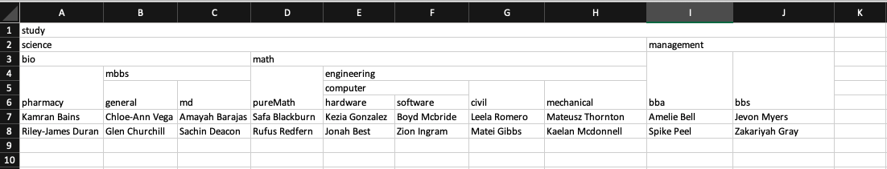

# json-excel

[](https://sonarcloud.io/dashboard?id=nksmkj7_json-excel)
[](https://sonarcloud.io/dashboard?id=nksmkj7_json-excel)
[](https://sonarcloud.io/dashboard?id=nksmkj7_json-excel)
[](https://sonarcloud.io/dashboard?id=nksmkj7_json-excel)
[](https://sonarcloud.io/dashboard?id=nksmkj7_json-excel)

# About
Take json object as an argument and convert them into excel data. \
Json object i.e.
```json
[{"study":{"science":{"bio":{"pharmacy":"ritu","mbbs":{"general":"roshan","md":"sanjay"}},"math":{"pureMath":"rukesh","engineering":{"computer":{"hardware":"Aungush","software":"nikesh"},"civil":"seena","mechanical":"santosh"}}},"management":{"bba":"pratik","bbs":"jeena"}}},{"study":{"science":{"bio":{"pharmacy":"rajani","mbbs":{"general":"haris","md":"shreetika"}},"math":{"pureMath":"prijal","engineering":{"computer":{"hardware":"samina","software":"anish"},"civil":"rasil","mechanical":"amit"}}},"management":{"bba":"anjeela","bbs":"sushmin"}}}];
```
is converted to below like excel.\


#### No need to manually merge cells now !! 😊 🤩

# Installation 
```js
npm install json-excel
```
This trait helps you to skip rows that don't satisfy specified rules in rules function and generated separated excel file of skipped rows with reasons.
# Usage
```js
const excel = require('json-excel');
const workbook = excel.generateExcel([
    {
      title: 'First sheet',
      data: [
        {
          study: {
            science: {
              bio: {
                pharmacy: 'bandana',
                mbbs: {
                  general: 'roshan',
                  md: 'sanjay',
                },
              },
              math: {
                pureMath: 'rukesh',
                engineering: {
                  computer: {
                    hardware: 'Aungush',
                    software: 'nikesh',
                  },
                  civil: 'seena',
                  mechanical: 'santosh',
                },
              },
            },
            management: {
              bba: 'pratik',
              bbs: 'jeena',
            },
          },
        },
        {
          study: {
            science: {
              bio: {
                pharmacy: 'rajani',
                mbbs: {
                  general: 'haris',
                  md: 'shreetika',
                },
              },
              math: {
                pureMath: 'prijal',
                engineering: {
                  computer: {
                    hardware: 'samina',
                    software: 'anish',
                  },
                  civil: 'rasil',
                  mechanical: 'amit',
                },
              },
            },
            management: {
              bba: 'anjeela',
              bbs: 'sushmin',
            },
          },
        },
      ],
    },
  ]);
```

> generateExcel function returns exceljs workbook instance. Hence, File I/O can be achieved same as in exceljs. For example: 
```js
// write to a file
await workbook.xlsx.writeFile('sample.xlsx');
```
> For the detail reference of [ File I/O](https://www.npmjs.com/package/exceljs#file-io)

# Method
generateExcel([{ title, data, delimiter, options }]). \ 
Method generate

### title
Title is name for sheet.

# How does it work ?
Brief description of trait's functions
| Function name | Arguments | Return value| Description
| ----------- | ----------- |----------- |----------- |
| rules | - | array | Laravel validation rules are returned as an array. Each row will get validated against those rules.
| messages | - | array | Custom messages for laravel validation rules.
| setModel | file path of model | - | Setup the model required for operation.
| getModel | - | instance of model | Get the model instance.
| getMessageBag | - | instance of messageBag | Collect the messages.
| totalRowsCount | collection of all rows | total row count of collection. | -
| headers | - | array | Headers for export excel of discarded rows.
| rejectedExcelDownloadUrl | - | string | Export discarded excel download url is set here.   ``` default: url('download-rejected-data/')```.
| prepareCsvData | collection/array | array | accept individual row and convert row data to array if it is a collection and return transformed data. 
| transform | array | array | Transformed data in order to store in database and return transformed data.
| validate | 1. array 2.callback | boolean | Validate individual row data against rule and execute callback if any.
| insert | collection | boolean | Accepts excel rows collection. Execute all the trait function in order to validate and insert data to database.
| exportRejectedData | array | boolean | Accept headers array and return true if there are rejected row, otherwise false.
| create | array | collection | Insert validated and transformed data into database. For extra logic, one needs to overwrite this function.

>Note: This trait only supports importing to collections. If trait is insufficient for your purpose, laravel-excel has its own row validation features. One can modify as per his/her needs.